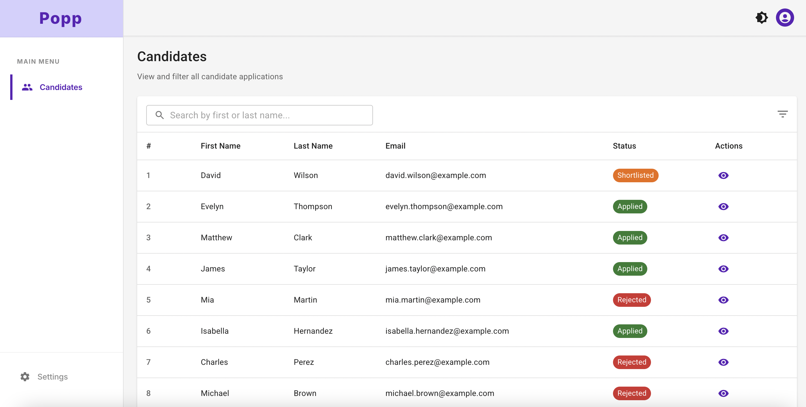
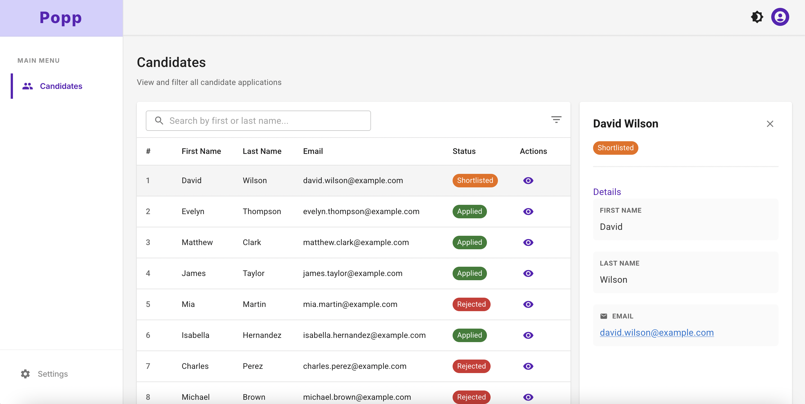

# Candidate Admin

Admin dashboard for managing candidate applications. React + TypeScript + Material UI + GraphQL.





## View

The application features a modern, responsive interface with:

- **Left Sidebar Navigation**: Branded "Popp" interface with main menu and settings
- **Candidates List View**: Table showing candidate information with search and filtering capabilities
- **Candidate Detail Panel**: Right-side panel displaying detailed candidate information when selected
- **Status Management**: Color-coded status tags (Shortlisted, Applied, Rejected) for easy visual identification
- **Responsive Design**: Mobile-friendly with hamburger menu and adaptive layout

## Project Structure

```
src/
├── app/              # App setup, routes, providers
├── pages/            # Dashboard, Candidates, Settings
├── components/       # Reusable UI (layout, tables, forms, feedback)
├── features/         # Domain logic (GraphQL queries, types)
├── lib/              # Utilities (API client, env, helpers)
└── styles/           # Theme config
```

## Tech Stack

React 18, TypeScript, Vite, Material UI v5, Apollo Client, React Router v6

## Prerequisites

Node.js 18+ and an AWS AppSync API key

## Setup

```bash
# Install
npm install

# Create .env and add your API key
cp .env.example .env
# Edit .env: VITE_GRAPHQL_API_KEY=your-key-here
# Get key from AWS Console → AppSync → Settings → API Keys

# Run
npm run dev
# Open http://localhost:5173

# Build
npm run build
```

## Features

- Dashboard with KPI cards and recent activity
- Candidates list with filters and pagination
- Light/dark theme toggle
- Mobile-responsive (hamburger menu on mobile, fixed sidebar on desktop)
- Server-side filtering with URL state
- GraphQL authentication via x-api-key header

## Scripts

```bash
npm run dev       # Dev server
npm run build     # Production build
npm test          # Run tests
npm run lint      # Lint code
```

## Customization

- Theme: `src/styles/theme.ts`
- Navigation: `src/components/layout/Sidebar/Sidebar.tsx`
- GraphQL types: `src/features/candidates/graphql/types.ts`

## Collaborators

- ilyesBen (GitHub)
- Alex (GitHub)

## Troubleshooting

**Env vars not loading?** Restart dev server after editing `.env`

**GraphQL errors?** Check API key is valid and endpoint URL is correct

**Build errors?** Try `rm -rf node_modules package-lock.json && npm install`

## License

MIT

